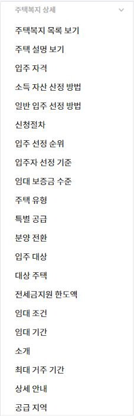

# 개발 환경
***

Python 3.9.7, Flask, Heroku/Github

# 블록 구성
***

- 메인 텍스트   
   

- 주택복지 목록 보기   
   

- 주택복지 상세   
   

- 공공주택 목록 보기   
   

# 기능
***

## 제네릭 메뉴

- 메인 / 주택복지 목록 보기 / 공공주택 목록 보기 3가지로 구성   

## 메인

- 주택복지/공공주택 목록 보기(basicCard 사용, button으로 이동)   

## 주택복지 목록 보기

- carousel/itemCard 사용
- 설명 보기 버튼을 누르면 좀 더 자세한 설명 출력
- 링크 연결을 누르면 해당 카드의 자세한 설명이 있는 url로 연결   

### 주택복지 목록 보기 - 설명 보기

- simpleText 사용
- quickReplies로 상세정보를 확인할 수 있음   
   

    + 상세정보에 들어가면 소개, 입주자격, 입주절차 등 여러개의 quickReplies로 구성이 됨
    + 버튼을 누르면 관련된 simpleText가 나오고 좀 더 자세한 설명은 url로 확인할 수 있음   
     
  

## 공공주택 목록 보기

- 17개의 지역으로 나눠져 있고, 첫 페이지에는 광역시도, 다음 페이지는 나머지 지역을 볼 수 있다
- quickReplies로 해당되는 지역의 공고를 확인할 수 있음   
   

- 버튼을 누르면 Carousel/basicCard 형태가 표시되고 자세히 보기 버튼을 누르면 해당되는 url로 이동 가능   

# 정보 수집
***

마이홈 포털에서 Selenium을 이용해 웹 크롤링   
Link : [마이홈 포털](https://www.myhome.go.kr/hws/portal/main/getMgtMainPage.do)

# 파일 설명
***

main : Blueprint 사용   
main_menu : 메인 텍스트 블록을 출력   
house_welfare : 주택복지 목록 블록 출력   
house_welfare_detail_n : 주택복지 상세 블록 출력      
region_list : 공공주택 목록 블록 출력   
crawl 폴더 : 크롤링 코드 / 데이터
